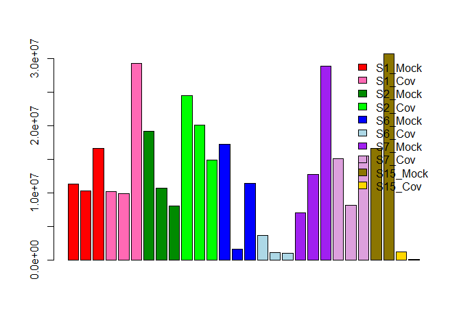

# Preliminary data cleaning and exploration

GSE data from
<https://www.ncbi.nlm.nih.gov/geo/query/acc.cgi?acc=GSE147507> human
data

<br>

### Loading GSE147507 count data

(This was saved and unzipped on my local computer)

``` r
GSE_data = read.table(file = file.choose(), sep = '\t', header = TRUE, row.names = 1)  
dim(GSE_data)
```

    ## [1] 21797    78

``` r
str(GSE_data)
```

    ## 'data.frame':    21797 obs. of  78 variables:
    ##  $ Series1_NHBE_Mock_1                : int  0 29 0 0 0 112 0 0 19 0 ...
    ##  $ Series1_NHBE_Mock_2                : int  0 24 0 0 0 119 0 0 21 0 ...
    ##  $ Series1_NHBE_Mock_3                : int  0 23 0 0 0 113 0 0 36 0 ...
    ##  $ Series1_NHBE_SARS.CoV.2_1          : int  0 34 0 0 0 127 0 0 16 0 ...
    ##  $ Series1_NHBE_SARS.CoV.2_2          : int  0 19 0 0 0 84 0 0 23 0 ...
    ##  $ Series1_NHBE_SARS.CoV.2_3          : int  0 44 0 0 0 270 0 0 54 0 ...
    ##  $ Series2_A549_Mock_1                : int  0 68 0 0 0 11 0 0 54 0 ...
    ##  $ Series2_A549_Mock_2                : int  0 43 0 0 0 3 0 0 23 0 ...
    ##  $ Series2_A549_Mock_3                : int  0 33 0 0 0 6 0 0 20 0 ...
    ##  $ Series2_A549_SARS.CoV.2_1          : int  0 65 0 0 0 8 0 0 45 0 ...
    ##  $ Series2_A549_SARS.CoV.2_2          : int  1 79 0 0 0 10 0 0 42 0 ...
    ##  $ Series2_A549_SARS.CoV.2_3          : int  1 48 0 0 0 10 0 0 36 0 ...
    ##  $ Series3_A549_Mock_1                : int  1 184 0 0 0 108 0 0 127 0 ...
    ##  $ Series3_A549_Mock_2                : int  0 128 0 0 0 95 0 0 93 0 ...
    ##  $ Series3_A549_RSV_1                 : int  0 51 0 0 0 37 0 0 25 0 ...
    ##  $ Series3_A549_RSV_2                 : int  0 43 0 0 0 11 0 0 16 0 ...
    ##  $ Series4_A549_Mock_1                : int  0 15 0 0 0 1 0 0 16 0 ...
    ##  $ Series4_A549_Mock_2                : int  0 12 0 0 0 5 0 0 14 0 ...
    ##  $ Series4_A549_IAV_1                 : int  0 3 0 0 0 0 0 0 10 0 ...
    ##  $ Series4_A549_IAV_2                 : int  0 3 0 0 0 2 0 0 3 0 ...
    ##  $ Series5_A549_Mock_1                : int  0 64 0 0 0 7 0 0 49 0 ...
    ##  $ Series5_A549_Mock_2                : int  0 53 0 0 0 14 0 0 51 0 ...
    ##  $ Series5_A549_Mock_3                : int  0 37 0 0 0 11 0 0 54 0 ...
    ##  $ Series5_A549_SARS.CoV.2_1          : int  0 38 0 0 0 1 0 0 31 0 ...
    ##  $ Series5_A549_SARS.CoV.2_2          : int  0 47 0 0 0 13 0 0 44 0 ...
    ##  $ Series5_A549_SARS.CoV.2_3          : int  0 65 0 0 0 4 0 0 99 0 ...
    ##  $ Series6_A549.ACE2_Mock_1           : int  0 37 0 0 0 13 0 0 26 0 ...
    ##  $ Series6_A549.ACE2_Mock_2           : int  0 4 0 0 0 2 0 0 2 0 ...
    ##  $ Series6_A549.ACE2_Mock_3           : int  0 22 0 0 0 18 0 0 19 0 ...
    ##  $ Series6_A549.ACE2_SARS.CoV.2_1     : int  0 1 0 0 0 9 0 0 9 0 ...
    ##  $ Series6_A549.ACE2_SARS.CoV.2_2     : int  0 2 0 0 0 2 0 0 3 0 ...
    ##  $ Series6_A549.ACE2_SARS.CoV.2_3     : int  0 4 0 0 0 1 0 0 6 0 ...
    ##  $ Series7_Calu3_Mock_1               : int  0 25 0 0 0 65 0 0 4 0 ...
    ##  $ Series7_Calu3_Mock_2               : int  0 60 0 0 0 184 0 0 14 0 ...
    ##  $ Series7_Calu3_Mock_3               : int  0 84 0 0 0 435 0 0 30 0 ...
    ##  $ Series7_Calu3_SARS.CoV.2_1         : int  1 47 0 0 0 271 0 0 14 0 ...
    ##  $ Series7_Calu3_SARS.CoV.2_2         : int  0 32 0 0 0 137 0 0 12 0 ...
    ##  $ Series7_Calu3_SARS.CoV.2_3         : int  0 41 0 0 0 265 0 0 23 0 ...
    ##  $ Series8_A549_Mock_1                : int  0 68 0 0 0 4 0 0 9 0 ...
    ##  $ Series8_A549_Mock_2                : int  0 17 0 0 0 3 0 0 10 0 ...
    ##  $ Series8_A549_Mock_3                : int  0 21 0 0 0 5 0 0 24 0 ...
    ##  $ Series8_A549_RSV_1                 : int  0 18 0 0 0 13 0 0 31 0 ...
    ##  $ Series8_A549_RSV_2                 : int  0 9 0 0 0 9 0 0 10 0 ...
    ##  $ Series8_A549_RSV_3                 : int  1 28 0 0 0 9 0 0 24 0 ...
    ##  $ Series8_A549_HPIV3_3               : int  0 12 0 0 0 3 0 0 20 0 ...
    ##  $ Series8_A549_HPIV3_2               : int  0 23 0 0 0 5 0 0 18 0 ...
    ##  $ Series8_A549_HPIV3_1               : int  0 14 0 0 0 5 0 0 23 0 ...
    ##  $ Series9_NHBE_Mock_1                : int  0 57 0 0 0 58 0 0 8 0 ...
    ##  $ Series9_NHBE_Mock_2                : int  0 58 0 0 0 51 0 0 6 0 ...
    ##  $ Series9_NHBE_Mock_3                : int  0 53 0 0 0 44 0 0 12 0 ...
    ##  $ Series9_NHBE_Mock_4                : int  0 89 0 0 0 93 0 0 10 0 ...
    ##  $ Series9_NHBE_IAV_1                 : int  0 102 0 0 0 107 0 0 33 0 ...
    ##  $ Series9_NHBE_IAV_2                 : int  0 26 0 0 0 37 0 0 10 0 ...
    ##  $ Series9_NHBE_IAV_3                 : int  0 21 0 0 0 30 0 0 11 0 ...
    ##  $ Series9_NHBE_IAV_4                 : int  0 7 0 0 0 10 0 0 3 0 ...
    ##  $ Series9_NHBE_IAVdNS1_1             : int  0 41 0 0 0 52 0 0 11 0 ...
    ##  $ Series9_NHBE_IAVdNS1_2             : int  0 56 0 0 0 52 0 0 10 0 ...
    ##  $ Series9_NHBE_IAVdNS1_3             : int  0 36 0 0 0 42 0 0 9 0 ...
    ##  $ Series9_NHBE_IAVdNS1_4             : int  0 131 0 0 0 101 0 0 17 0 ...
    ##  $ Series9_NHBE_IFNB_4h_1             : int  0 72 0 0 0 94 0 0 10 0 ...
    ##  $ Series9_NHBE_IFNB_4h_2             : int  0 66 0 0 0 102 0 0 5 0 ...
    ##  $ Series9_NHBE_IFNB_6h_1             : int  0 46 0 0 0 52 0 0 12 0 ...
    ##  $ Series9_NHBE_IFNB_6h_2             : int  0 35 0 0 0 41 0 0 10 0 ...
    ##  $ Series9_NHBE_IFNB_12h_1            : int  0 48 0 0 0 41 0 0 10 0 ...
    ##  $ Series9_NHBE_IFNB_12h_2            : int  0 46 0 0 0 60 0 0 3 0 ...
    ##  $ Series15_HealthyLungBiopsy_2       : int  0 261 0 0 0 15 0 0 11 0 ...
    ##  $ Series15_HealthyLungBiopsy_1       : int  0 140 0 0 0 70 0 0 21 0 ...
    ##  $ Series15_COVID19Lung_2             : int  0 0 0 0 0 17 0 0 0 0 ...
    ##  $ Series15_COVID19Lung_1             : int  0 0 0 0 0 0 0 0 0 0 ...
    ##  $ Series16_A549.ACE2_Mock_1          : int  0 0 0 0 0 1 0 0 2 0 ...
    ##  $ Series16_A549.ACE2_Mock_2          : int  0 11 0 0 0 2 0 0 10 0 ...
    ##  $ Series16_A549.ACE2_Mock_3          : int  0 7 0 0 0 2 0 0 5 0 ...
    ##  $ Series16_A549.ACE2_SARS.CoV.2_1    : int  0 2 0 0 0 0 0 0 4 0 ...
    ##  $ Series16_A549.ACE2_SARS.CoV.2_2    : int  0 6 0 0 0 0 0 0 1 0 ...
    ##  $ Series16_A549.ACE2_SARS.CoV.2_3    : int  0 5 0 0 0 1 0 0 4 0 ...
    ##  $ Series16_A549.ACE2_SARS.CoV.2_Rux_1: int  0 12 0 0 0 4 0 0 9 0 ...
    ##  $ Series16_A549.ACE2_SARS.CoV.2_Rux_2: int  0 6 0 0 0 0 0 0 2 0 ...
    ##  $ Series16_A549.ACE2_SARS.CoV.2_Rux_3: int  0 8 0 0 0 2 0 0 4 0 ...

<br>

### For this analysis, I’m only interestedin a subset of this data referring to Series 1, 2, 6, 7, and 15

``` r
library(dplyr)
```

    ## Warning: package 'dplyr' was built under R version 4.1.3

``` r
Series = paste("Series", c(1,2,6,7,15), "_", sep = "")
GSE_data = GSE_data %>% select(starts_with(Series))

#Renaming columns for clarity
 columns = c(paste("S1_Mock", 1:3, sep = ""), paste("S1_Cov", 1:3, sep = ""), paste("S2_Mock", 1:3, sep = ""),paste("S2_Cov", 1:3, sep = ""), paste("S6_Mock", 1:3, sep = ""),paste("S6_Cov", 1:3, sep = ""), paste("S7_Mock", 1:3, sep = ""),paste("S7_Cov", 1:3, sep = ""), paste("S15_Mock", 1:2, sep = ""),paste("S15_Cov", 1:2, sep = ""))

colnames(GSE_data) = columns 
head(GSE_data[,c(1:8)])  # Note that the row names are geneIDs
```

    ##           S1_Mock1 S1_Mock2 S1_Mock3 S1_Cov1 S1_Cov2 S1_Cov3 S2_Mock1 S2_Mock2
    ## DDX11L1          0        0        0       0       0       0        0        0
    ## WASH7P          29       24       23      34      19      44       68       43
    ## FAM138A          0        0        0       0       0       0        0        0
    ## FAM138F          0        0        0       0       0       0        0        0
    ## OR4F5            0        0        0       0       0       0        0        0
    ## LOC729737      112      119      113     127      84     270       11        3

``` r
#write.csv(GSE_data, file = "GSE147507_subset_clean.csv")
```

<br>

### We will need a dataframe outlining the experiemental design for future DGE analysis.

``` r
coldata = colnames(GSE_data) # These are the names of the samples

condition = c(rep(c("mock", "covid"), each = 3,4),rep(c("mock", "covid"), each = 2)) # For each sample, there are 2 possible conditions: mock or covid

condition= factor(condition, levels = c("mock","covid")) # Setting up the 'mock' condition as factor level 1  

cell_type = c(rep("NHBE", 6),rep("A549", 6),rep("A549-ACE2", 6),rep("Calu3", 6),rep("Lung", 4)) # each series refers to a different cell type  

coldata = data.frame(condition, cell_type, row.names = coldata) # combining vectors into a df
head(coldata)
```

    ##          condition cell_type
    ## S1_Mock1      mock      NHBE
    ## S1_Mock2      mock      NHBE
    ## S1_Mock3      mock      NHBE
    ## S1_Cov1      covid      NHBE
    ## S1_Cov2      covid      NHBE
    ## S1_Cov3      covid      NHBE

``` r
#write.csv(coldata, file = "design_data.csv")
```

<br>

### Viewing distribution of reads per sample

``` r
totals = colSums(GSE_data) #### sum counts for each column

colors <- c(rep(c("red", "hotpink", "green4", "green", "blue", "lightblue", "purple", "plum"), each = 3), rep(c("gold4", "gold"), each = 2))

barplot(totals, col = colors, names.arg = "")

legend(x = "topright", legend=c("S1_Mock","S1_Cov","S2_Mock","S2_Cov","S6_Mock","S6_Cov","S7_Mock","S7_Cov","S15_Mock","S15_Cov"), fill = c("red", "hotpink", "green4", "green", "blue", "lightblue", "purple", "plum","gold4", "gold"), bty = "n")
```

<!-- -->
