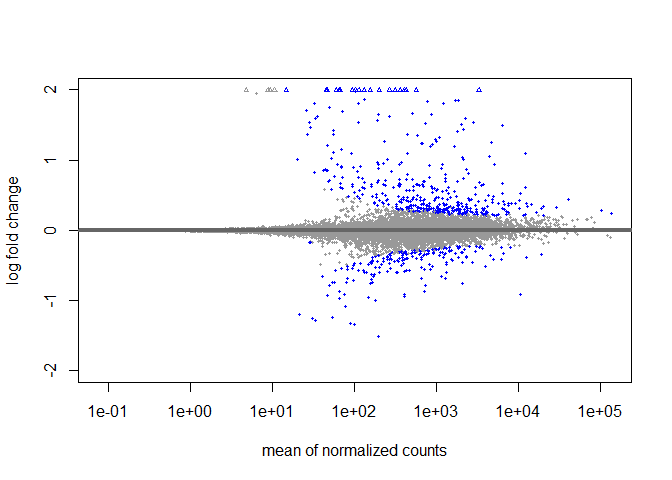
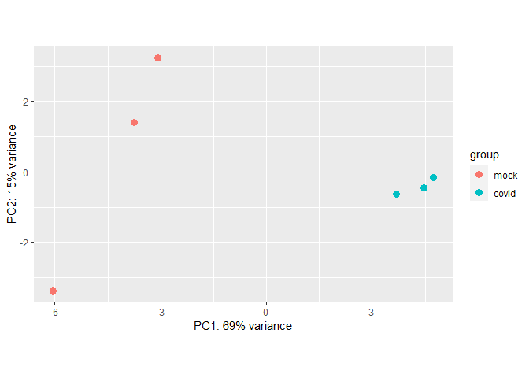

DESeq2
================

## Using DESeq2 for Differential Gene Expression analysis

### The starting GSE_data dataframes were created as described in [Cleaning_GSE_data](https://github.com/Amonae/Differential-Gene-Expression/blob/main/Cleaning_GSE_data/cleaning_GSE_data.R)

The clean data set was created from GSE data from
<https://www.ncbi.nlm.nih.gov/geo/query/acc.cgi?acc=GSE147507> human
data <br>

``` r
# library(DESeq2)
# BiocManager::install("apeglm")

### Loading the data
GSE_data = read.csv("data/GSE147507_subset_clean.csv", row.names = 1)
coldata = read.csv("data/design_data.csv", row.names = 1)

head(GSE_data[,1:8])
```

    ##           S1_Mock1 S1_Mock2 S1_Mock3 S1_Cov1 S1_Cov2 S1_Cov3 S2_Mock1 S2_Mock2
    ## DDX11L1          0        0        0       0       0       0        0        0
    ## WASH7P          29       24       23      34      19      44       68       43
    ## FAM138A          0        0        0       0       0       0        0        0
    ## FAM138F          0        0        0       0       0       0        0        0
    ## OR4F5            0        0        0       0       0       0        0        0
    ## LOC729737      112      119      113     127      84     270       11        3

``` r
head(coldata)
```

    ##          condition cell_type
    ## S1_Mock1      mock      NHBE
    ## S1_Mock2      mock      NHBE
    ## S1_Mock3      mock      NHBE
    ## S1_Cov1      covid      NHBE
    ## S1_Cov2      covid      NHBE
    ## S1_Cov3      covid      NHBE

<br>

## Looking at DEGs in NHBE cells only (Series 1)

``` r
# Note DESeq will automatically convert "condition" into a factor once the DESeqDataSetis created.
# By default, the factors will be set in alphabetical order (covid < mock). 
# Here, I am reversing that order  

coldata$condition = factor(coldata$condition, levels = c("mock","covid")) 

dds_NHBE = DESeqDataSetFromMatrix(countData = GSE_data[,1:6],
                              colData = coldata[1:6,],
                              design = ~ condition)    # Creating DESeq dataset


dds_NHBE = DESeq(dds_NHBE)   # Calling DESeq function

dge_NHBE = results(dds_NHBE) #Results object
dge_NHBE    # Note that the LFC is based on covid vs mock. So positive values represent genes that are upregulated in cells with covid
```

    ## log2 fold change (MLE): condition covid vs mock 
    ## Wald test p-value: condition covid vs mock 
    ## DataFrame with 21797 rows and 6 columns
    ##            baseMean log2FoldChange     lfcSE      stat    pvalue      padj
    ##           <numeric>      <numeric> <numeric> <numeric> <numeric> <numeric>
    ## DDX11L1      0.0000             NA        NA        NA        NA        NA
    ## WASH7P      29.1301       0.133856  0.440935  0.303574  0.761453  0.943622
    ## FAM138A      0.0000             NA        NA        NA        NA        NA
    ## FAM138F      0.0000             NA        NA        NA        NA        NA
    ## OR4F5        0.0000             NA        NA        NA        NA        NA
    ## ...             ...            ...       ...       ...       ...       ...
    ## CDY1B             0             NA        NA        NA        NA        NA
    ## CDY1              0             NA        NA        NA        NA        NA
    ## CSPG4P1Y          0             NA        NA        NA        NA        NA
    ## GOLGA2P3Y         0             NA        NA        NA        NA        NA
    ## GOLGA2P2Y         0             NA        NA        NA        NA        NA

### Going to shrink results for better visualization and ranking of genes.

``` r
dge_NHBE_shrink = lfcShrink(dds_NHBE, coef="condition_covid_vs_mock", type="apeglm")

dge_NHBE_shrink
```

    ## log2 fold change (MAP): condition covid vs mock 
    ## Wald test p-value: condition covid vs mock 
    ## DataFrame with 21797 rows and 5 columns
    ##            baseMean log2FoldChange     lfcSE    pvalue      padj
    ##           <numeric>      <numeric> <numeric> <numeric> <numeric>
    ## DDX11L1      0.0000             NA        NA        NA        NA
    ## WASH7P      29.1301      0.0101653  0.122305  0.761453  0.943622
    ## FAM138A      0.0000             NA        NA        NA        NA
    ## FAM138F      0.0000             NA        NA        NA        NA
    ## OR4F5        0.0000             NA        NA        NA        NA
    ## ...             ...            ...       ...       ...       ...
    ## CDY1B             0             NA        NA        NA        NA
    ## CDY1              0             NA        NA        NA        NA
    ## CSPG4P1Y          0             NA        NA        NA        NA
    ## GOLGA2P3Y         0             NA        NA        NA        NA
    ## GOLGA2P2Y         0             NA        NA        NA        NA

### Reviewing information about which variables and tests were used

``` r
mcols(dge_NHBE_shrink)$description
```

    ## [1] "mean of normalized counts for all samples"      
    ## [2] "log2 fold change (MAP): condition covid vs mock"
    ## [3] "posterior SD: condition covid vs mock"          
    ## [4] "Wald test p-value: condition covid vs mock"     
    ## [5] "BH adjusted p-values"

### Reviewing Log Fold Change (LFC) statistics

``` r
summary(dge_NHBE_shrink)  # note that here, the minimum pvalue is < 0.1
```

    ## 
    ## out of 16360 with nonzero total read count
    ## adjusted p-value < 0.1
    ## LFC > 0 (up)       : 404, 2.5%
    ## LFC < 0 (down)     : 191, 1.2%
    ## outliers [1]       : 0, 0%
    ## low counts [2]     : 4363, 27%
    ## (mean count < 12)
    ## [1] see 'cooksCutoff' argument of ?results
    ## [2] see 'independentFiltering' argument of ?results

### Lowering the p value threshold

``` r
summary(dge_NHBE_shrink, alpha = 0.05) # setting the minimum pvalue to < 0.05
```

    ## 
    ## out of 16360 with nonzero total read count
    ## adjusted p-value < 0.05
    ## LFC > 0 (up)       : 301, 1.8%
    ## LFC < 0 (down)     : 111, 0.68%
    ## outliers [1]       : 0, 0%
    ## low counts [2]     : 4363, 27%
    ## (mean count < 12)
    ## [1] see 'cooksCutoff' argument of ?results
    ## [2] see 'independentFiltering' argument of ?results

``` r
# How many genes have padj < 0.05

sum(dge_NHBE_shrink$padj < 0.05, na.rm=TRUE) 
```

    ## [1] 412

### Viewing the genes with the 7 lowest p values

``` r
ordered_p = dge_NHBE_shrink[order(dge_NHBE_shrink$pvalue),] # This orders the output by lowest pvalues

head(ordered_p, 7) 
```

    ## log2 fold change (MAP): condition covid vs mock 
    ## Wald test p-value: condition covid vs mock 
    ## DataFrame with 7 rows and 5 columns
    ##          baseMean log2FoldChange     lfcSE      pvalue        padj
    ##         <numeric>      <numeric> <numeric>   <numeric>   <numeric>
    ## CCL20     412.115        3.12668  0.166197 3.26103e-80 3.91226e-76
    ## SAA2      575.767        2.40902  0.128831 3.39756e-79 2.03803e-75
    ## SAA1     3315.936        2.20464  0.139269 8.60842e-58 3.44251e-54
    ## IL36G     271.324        2.70908  0.178573 2.36828e-53 6.99474e-50
    ## S100A8   1706.973        1.85374  0.122244 2.91521e-53 6.99474e-50
    ## TNFAIP3  2288.722        1.59860  0.106327 2.40995e-52 4.81869e-49
    ## SPRR2D    365.198        2.95386  0.198069 1.75573e-51 3.00906e-48

### Viewing MA plot

``` r
# This plot shows LFC of genes with significant genes colored blue

plotMA(dge_NHBE_shrink, ylim=c(-2,2))  
```

<!-- -->

### Transforming data and Viewing PCA plot

``` r
# data needs to be transformed before PCA to mthematically remove sources of unwanted variations
transformed = rlog(dds_NHBE, blind=FALSE)
plotPCA(transformed)
```

<!-- -->
