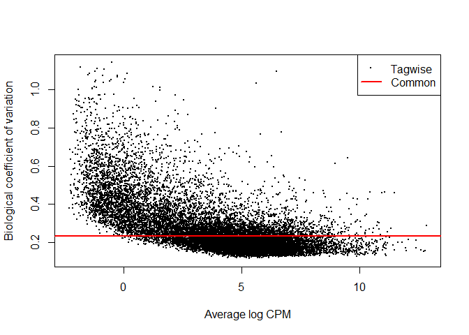
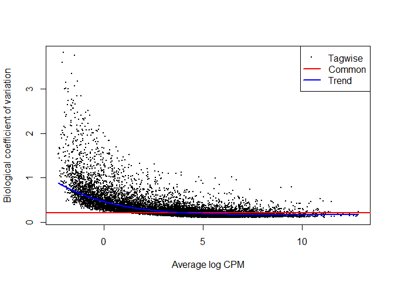
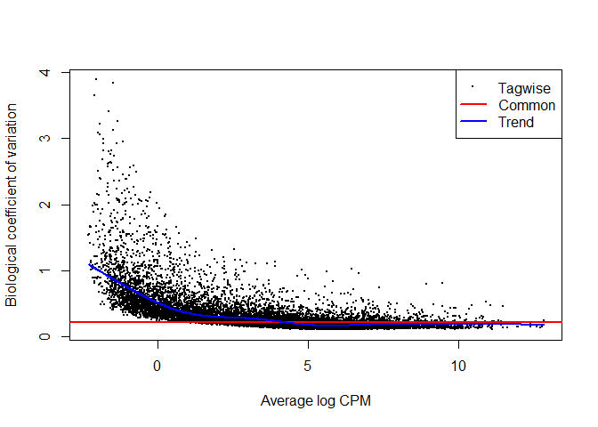
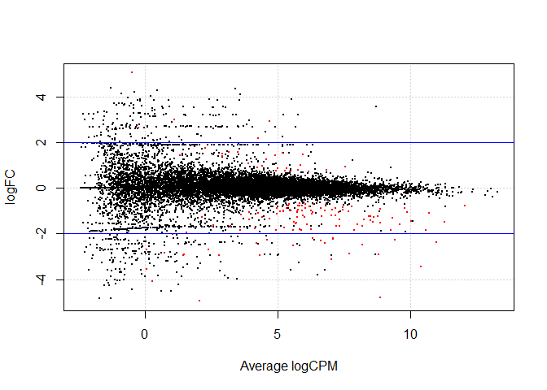

EdgeR
================

## Using EdgeR to perform Differential Expression Analysis

### The starting GSE_data dataframes were created as described in [Cleaning_GSE_data](https://github.com/Amonae/Differential-Gene-Expression/blob/main/Cleaning_GSE_data/cleaning_GSE_data.R)

The clean data set was created from GSE data from
<https://www.ncbi.nlm.nih.gov/geo/query/acc.cgi?acc=GSE147507> human
data <br>

``` r
# library(edgeR)
# library("statmod")

### Loading the data
GSE_data = read.csv("data/GSE147507_subset_clean.csv", row.names = 1)
coldata = read.csv("data/design_data.csv", row.names = 1)

head(GSE_data[,1:8])
```

    ##           S1_Mock1 S1_Mock2 S1_Mock3 S1_Cov1 S1_Cov2 S1_Cov3 S2_Mock1 S2_Mock2
    ## DDX11L1          0        0        0       0       0       0        0        0
    ## WASH7P          29       24       23      34      19      44       68       43
    ## FAM138A          0        0        0       0       0       0        0        0
    ## FAM138F          0        0        0       0       0       0        0        0
    ## OR4F5            0        0        0       0       0       0        0        0
    ## LOC729737      112      119      113     127      84     270       11        3

``` r
head(coldata)
```

    ##          condition cell_type
    ## S1_Mock1      mock      NHBE
    ## S1_Mock2      mock      NHBE
    ## S1_Mock3      mock      NHBE
    ## S1_Cov1      covid      NHBE
    ## S1_Cov2      covid      NHBE
    ## S1_Cov3      covid      NHBE

<br>

## Creating a DGEList object

#### First need to define groups for the samples

``` r
groups = factor(paste(coldata$condition,coldata$cell_type,sep="_"), levels = unique(paste(coldata$condition,coldata$cell_type,sep="_")))
coldata$Group = groups # adding "groups" as a column to coldata
head(coldata)
```

    ##          condition cell_type      Group
    ## S1_Mock1      mock      NHBE  mock_NHBE
    ## S1_Mock2      mock      NHBE  mock_NHBE
    ## S1_Mock3      mock      NHBE  mock_NHBE
    ## S1_Cov1      covid      NHBE covid_NHBE
    ## S1_Cov2      covid      NHBE covid_NHBE
    ## S1_Cov3      covid      NHBE covid_NHBE

#### Creating DGEList

``` r
dge = DGEList(GSE_data, group = groups)
dim(dge)
```

    ## [1] 21797    28

``` r
head(dge$samples)
```

    ##               group lib.size norm.factors
    ## S1_Mock1  mock_NHBE 11258863            1
    ## S1_Mock2  mock_NHBE 10256909            1
    ## S1_Mock3  mock_NHBE 16601859            1
    ## S1_Cov1  covid_NHBE 10195139            1
    ## S1_Cov2  covid_NHBE  9904002            1
    ## S1_Cov3  covid_NHBE 29316471            1

#### Going to filter out low count genes

``` r
keep = filterByExpr(dge,group = groups)
dge = dge[keep,keep.lib.size=FALSE]
dim(dge)
```

    ## [1] 15607    28

``` r
head(dge$samples)
```

    ##               group lib.size norm.factors
    ## S1_Mock1  mock_NHBE 11257202            1
    ## S1_Mock2  mock_NHBE 10255133            1
    ## S1_Mock3  mock_NHBE 16599457            1
    ## S1_Cov1  covid_NHBE 10193721            1
    ## S1_Cov2  covid_NHBE  9902551            1
    ## S1_Cov3  covid_NHBE 29312343            1

## Comparing Different normalization methods

#### TMM

``` r
dge_tmm = calcNormFactors(dge, method="TMM")
head(dge_tmm$samples)
```

    ##               group lib.size norm.factors
    ## S1_Mock1  mock_NHBE 11257202    0.9341216
    ## S1_Mock2  mock_NHBE 10255133    0.9600357
    ## S1_Mock3  mock_NHBE 16599457    0.9590499
    ## S1_Cov1  covid_NHBE 10193721    0.9181320
    ## S1_Cov2  covid_NHBE  9902551    0.9193682
    ## S1_Cov3  covid_NHBE 29312343    0.9105626

#### RLE

``` r
dge_rle = calcNormFactors(dge, method="RLE")
head(dge_rle$samples)
```

    ##               group lib.size norm.factors
    ## S1_Mock1  mock_NHBE 11257202    0.9711755
    ## S1_Mock2  mock_NHBE 10255133    0.9888041
    ## S1_Mock3  mock_NHBE 16599457    1.0209728
    ## S1_Cov1  covid_NHBE 10193721    0.9789384
    ## S1_Cov2  covid_NHBE  9902551    0.9846171
    ## S1_Cov3  covid_NHBE 29312343    0.9856840

#### Upper Quartile

``` r
dge_uq = calcNormFactors(dge, method="upperquartile")
head(dge_uq$samples)
```

    ##               group lib.size norm.factors
    ## S1_Mock1  mock_NHBE 11257202     1.017298
    ## S1_Mock2  mock_NHBE 10255133     1.039346
    ## S1_Mock3  mock_NHBE 16599457     1.068545
    ## S1_Cov1  covid_NHBE 10193721     1.025653
    ## S1_Cov2  covid_NHBE  9902551     1.018837
    ## S1_Cov3  covid_NHBE 29312343     1.011759

## Viewing MDS Plots based on each normalization technique

#### TMM

``` r
colors = c(rep(c("red", "hotpink", "green4", "green", "blue4", "blue", "purple", "plum"), each = 3), rep(c("gold4", "gold"), each = 2))

plotMDS(dge_tmm, col=colors, pch=16)

legend("topleft", legend= unique(groups), pch=16, col=unique(colors), cex = 0.6)  
```

<!-- -->

#### RLE

``` r
plotMDS(dge_rle, col=colors, pch=16)

legend("topleft", legend= unique(groups), pch=16, col=unique(colors), cex = 0.6)
```

<!-- -->

#### UQ

``` r
plotMDS(dge_uq, col=colors, pch=16)

legend("topleft", legend= unique(groups), pch=16, col=unique(colors), cex = 0.6)
```

<!-- -->

## Estimating dispersion

Using dge_TMM to start

``` r
dge_tmm_c.disp = estimateCommonDisp(dge_tmm, verbose=T) # Common dispersion is the mean dispersion across all genes
```

    ## Disp = 0.05455 , BCV = 0.2335

``` r
dge_tmm_t.disp = estimateTagwiseDisp(dge_tmm_c.disp) # tagwise dispersion is the dispersion for each gene

## Note. You must calculate common dispersion before tagwise dispersion can be calculated
```

#### Viewing BCV plot

``` r
plotBCV(dge_tmm_t.disp) 
```

<!-- --> Note there is
a downward trend in coefficient of variation as cpm increases, so using
common dispersion may not be appropriate

<br>

#### Creating a design matrix for use with glm fit

``` r
design = model.matrix(~ 0 + dge_tmm$samples$group)
colnames(design) = levels(dge_tmm$samples$group)
head(design)
```

    ##   mock_NHBE covid_NHBE mock_A549 covid_A549 mock_A549-ACE2 covid_A549-ACE2
    ## 1         1          0         0          0              0               0
    ## 2         1          0         0          0              0               0
    ## 3         1          0         0          0              0               0
    ## 4         0          1         0          0              0               0
    ## 5         0          1         0          0              0               0
    ## 6         0          1         0          0              0               0
    ##   mock_Calu3 covid_Calu3 mock_Lung covid_Lung
    ## 1          0           0         0          0
    ## 2          0           0         0          0
    ## 3          0           0         0          0
    ## 4          0           0         0          0
    ## 5          0           0         0          0
    ## 6          0           0         0          0

### GLM dispersion estimates

**Power method**

``` r
dge_tmm_c.disp = estimateGLMCommonDisp(dge_tmm,design, verbose=T) # estimating common dispersion based on glm model
```

    ## Disp = 0.04545 , BCV = 0.2132

``` r
dge_tmm_tr.disp = estimateGLMTrendedDisp(dge_tmm_c.disp,design, method="power") #trended dispersion

dge_tmm_tag.disp = estimateGLMTagwiseDisp(dge_tmm_tr.disp,design) #tagwise dispersion

plotBCV(dge_tmm_tag.disp)
```

<!-- -->

**bin.spline method**

``` r
dge_tmm_c.disp = estimateGLMCommonDisp(dge_tmm,design, verbose=T) # estimating common dispersion based on glm model
```

    ## Disp = 0.04545 , BCV = 0.2132

``` r
dge_tmm_tr.disp = estimateGLMTrendedDisp(dge_tmm_c.disp,design, method="bin.spline") #trended dispersion

dge_tmm_tag.disp = estimateGLMTagwiseDisp(dge_tmm_tr.disp,design) #tagwise dispersion

plotBCV(dge_tmm_tag.disp)
```

<!-- -->

## Identifying Differentially expressed genes

<br>

### Comparing top DEGs by dispersion method

<br>

#### GLM common dispersion

``` r
# Note. for this step: dge_tmm_c.disp = estimateGLMCommonDisp(dge_tmm,design)
fit = glmQLFit(dge_tmm_c.disp, design)

#Viewing pairwise NHBE Mock vs Cov
NHBE_dge = glmLRT(fit, contrast=c(1,-1,rep(0,8)))
topTags(NHBE_dge, n=10)
```

    ## Coefficient:  1*mock_NHBE -1*covid_NHBE 
    ##            logFC     logCPM        LR       PValue          FDR
    ## CSF3   -4.813046  8.8837335 144.75401 2.430751e-33 3.793673e-29
    ## CCL20  -3.146291  7.0278148 121.49152 2.982736e-28 2.327578e-24
    ## CXCL5  -3.483684 10.4362436 114.71321 9.094309e-27 4.731163e-23
    ## SPRR2D -2.976141  2.9180199 109.75190 1.110556e-25 4.333114e-22
    ## IFI27  -2.903837  7.6879888 103.69996 2.353963e-24 7.347661e-21
    ## IL36G  -2.724186  2.5293896  91.65857 1.029987e-21 2.679168e-18
    ## SPRR2E -3.576092  0.1931457  90.43857 1.908103e-21 4.254251e-18
    ## IL6    -2.914088  8.7866346  88.24446 5.784515e-21 1.128487e-17
    ## MX1    -2.500840  7.9922018  82.26814 1.188219e-19 2.060505e-16
    ## SAA2   -2.429179  4.3135475  79.77250 4.200993e-19 6.556490e-16

#### GLM trended dispersion

``` r
# dge_tmm_tr.disp = estimateGLMTrendedDisp(dge_tmm_c.disp,design, method="bin.spline")
fit = glmQLFit(dge_tmm_tr.disp, design)

#Viewing pairwise NHBE Mock vs Cov
NHBE_dge = glmLRT(fit, contrast=c(1,-1,rep(0,8)))
topTags(NHBE_dge, n=10)
```

    ## Coefficient:  1*mock_NHBE -1*covid_NHBE 
    ##              logFC    logCPM        LR       PValue          FDR
    ## CCL20    -3.145956  7.027815 165.47599 7.200000e-38 1.123704e-33
    ## CSF3     -4.811465  8.883734 163.31358 2.136568e-37 1.667271e-33
    ## CXCL5    -3.480128 10.436244 138.33822 6.146416e-32 3.197571e-28
    ## IFI27    -2.908527  7.687989 129.63598 4.922594e-30 1.920673e-26
    ## SAA1     -2.221621  6.439494 113.28777 1.866245e-26 5.825296e-23
    ## IL6      -2.918938  8.786635 103.51933 2.578662e-24 6.707528e-21
    ## MX1      -2.503644  7.992202 101.46214 7.284240e-24 1.624073e-20
    ## XAF1     -2.542820  5.527452 101.05927 8.927162e-24 1.741578e-20
    ## MMP9     -2.283511  4.769492  91.10644 1.361481e-21 2.315432e-18
    ## PDZK1IP1 -2.423828  6.854619  90.77342 1.611034e-21 2.315432e-18

#### GLM tagwise dispersion

``` r
# dge_tmm_tag.disp = estimateGLMTagwiseDisp(dge_tmm_tr.disp,design)
fit = glmQLFit(dge_tmm_tag.disp, design)

#Viewing pairwise NHBE Mock vs Cov
NHBE_dge = glmLRT(fit, contrast=c(1,-1,rep(0,8)))
topTags(NHBE_dge, n=10)
```

    ## Coefficient:  1*mock_NHBE -1*covid_NHBE 
    ##              logFC    logCPM        LR       PValue          FDR
    ## CCL20    -3.145956  7.027815 165.47599 7.200000e-38 1.123704e-33
    ## CSF3     -4.811465  8.883734 163.31358 2.136568e-37 1.667271e-33
    ## CXCL5    -3.480128 10.436244 138.33822 6.146416e-32 3.197571e-28
    ## IFI27    -2.908527  7.687989 129.63598 4.922594e-30 1.920673e-26
    ## SAA1     -2.221621  6.439494 113.28777 1.866245e-26 5.825296e-23
    ## IL6      -2.918938  8.786635 103.51933 2.578662e-24 6.707528e-21
    ## MX1      -2.503644  7.992202 101.46214 7.284240e-24 1.624073e-20
    ## XAF1     -2.542820  5.527452 101.05927 8.927162e-24 1.741578e-20
    ## MMP9     -2.283511  4.769492  91.10644 1.361481e-21 2.315432e-18
    ## PDZK1IP1 -2.423828  6.854619  90.77342 1.611034e-21 2.315432e-18

### Generating a list of DEGs

(trended glm dispersion, method=“bin.spline”)

``` r
NHBE_dge_list = decideTestsDGE(NHBE_dge, adjust.method="BH", p.value=0.05)

summary(NHBE_dge_list)
```

    ##        1*mock_NHBE -1*covid_NHBE
    ## Down                         116
    ## NotSig                     15465
    ## Up                            26

#### Viewing Smear plot

``` r
TMM = rownames(dge_tmm_tag.disp)[as.logical(NHBE_dge_list)]

length(TMM) # number of DEGs
```

    ## [1] 142

``` r
plotSmear(NHBE_dge, de.tags=TMM)
abline(h = c(-2, 2), col = "blue")
```

<!-- -->

## Exploring how normalization affects DGE list in NHBE cells only

#### RLE

``` r
dge1 = estimateGLMCommonDisp(dge_rle,design, verbose=T) # estimating common dispersion based on glm model
```

    ## Disp = 0.04557 , BCV = 0.2135

``` r
dge1 = estimateGLMTrendedDisp(dge1,design, method="bin.spline") #trended dispersion

fit = glmQLFit(dge1, design)

NHBE_dge = glmLRT(fit, contrast=c(1,-1,rep(0,8)))

NHBE_dge_list = decideTestsDGE(NHBE_dge, adjust.method="BH", p.value=0.05)

RLE = rownames(dge1)[as.logical(NHBE_dge_list)]
length(RLE) # number of DEGs
```

    ## [1] 135

``` r
plotSmear(NHBE_dge, de.tags=RLE)
abline(h = c(-2, 2), col = "blue")
```

<!-- -->

#### UQ

``` r
dge1 = estimateGLMCommonDisp(dge_uq,design, verbose=T) # estimating common dispersion based on glm model
```

    ## Disp = 0.0444 , BCV = 0.2107

``` r
dge1 = estimateGLMTrendedDisp(dge1,design, method="bin.spline") #trended dispersion

fit = glmQLFit(dge1, design)

NHBE_dge = glmLRT(fit, contrast=c(1,-1,rep(0,8)))

NHBE_dge_list = decideTestsDGE(NHBE_dge, adjust.method="BH", p.value=0.05)

UQ = rownames(dge1)[as.logical(NHBE_dge_list)]
length(UQ) # number of DEGs
```

    ## [1] 145

``` r
plotSmear(NHBE_dge, de.tags=UQ)
abline(h = c(-2, 2), col = "blue")
```

<!-- -->

### Venn Diagram of Comparison

``` r
#library("ggVennDiagram")

gene_list = list(TMM, RLE, UQ)
ggVennDiagram(gene_list, label_alpha = 0, category.names = c("TMM","RLE","UQ"))+ ggplot2::scale_fill_gradient(low="white",high = "blue")
```

<!-- -->
