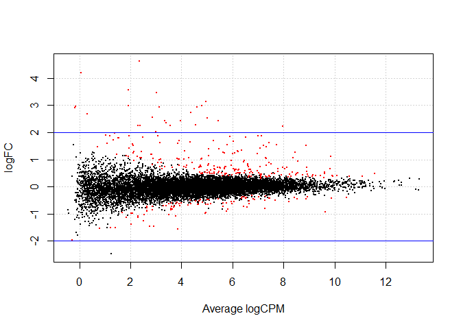
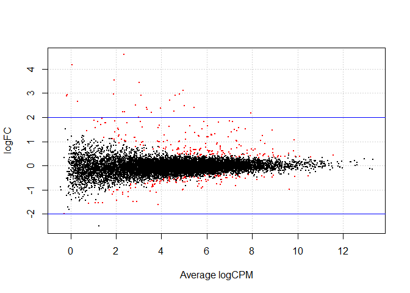

EdgeR
================

## Using EdgeR to perform Differential Expression Analysis

### The starting GSE_data dataframes were created as described in [Cleaning_GSE_data](https://github.com/Amonae/Differential-Gene-Expression/blob/main/Cleaning_GSE_data/cleaning_GSE_data.R)

The clean data set was created from GSE data from
<https://www.ncbi.nlm.nih.gov/geo/query/acc.cgi?acc=GSE147507> human
data <br>

``` r
# library(edgeR)
# library("statmod")

### Loading the data
GSE_data = read.csv("data/GSE147507_subset_clean.csv", row.names = 1)
coldata = read.csv("data/design_data.csv", row.names = 1)

head(GSE_data[,1:8])
```

    ##           S1_Mock1 S1_Mock2 S1_Mock3 S1_Cov1 S1_Cov2 S1_Cov3 S2_Mock1 S2_Mock2
    ## DDX11L1          0        0        0       0       0       0        0        0
    ## WASH7P          29       24       23      34      19      44       68       43
    ## FAM138A          0        0        0       0       0       0        0        0
    ## FAM138F          0        0        0       0       0       0        0        0
    ## OR4F5            0        0        0       0       0       0        0        0
    ## LOC729737      112      119      113     127      84     270       11        3

``` r
head(coldata)
```

    ##          condition cell_type
    ## S1_Mock1      mock      NHBE
    ## S1_Mock2      mock      NHBE
    ## S1_Mock3      mock      NHBE
    ## S1_Cov1      covid      NHBE
    ## S1_Cov2      covid      NHBE
    ## S1_Cov3      covid      NHBE

<br>

## Creating a DGEList object

#### First need to define groups for the samples

``` r
groups = factor(paste(coldata$condition,coldata$cell_type,sep="_"), levels = unique(paste(coldata$condition,coldata$cell_type,sep="_")))
coldata$Group = groups # adding "groups" as a column to coldata
head(coldata)
```

    ##          condition cell_type      Group
    ## S1_Mock1      mock      NHBE  mock_NHBE
    ## S1_Mock2      mock      NHBE  mock_NHBE
    ## S1_Mock3      mock      NHBE  mock_NHBE
    ## S1_Cov1      covid      NHBE covid_NHBE
    ## S1_Cov2      covid      NHBE covid_NHBE
    ## S1_Cov3      covid      NHBE covid_NHBE

#### Creating DGEList

``` r
dge = DGEList(GSE_data, group = groups)
dim(dge)
```

    ## [1] 21797    28

``` r
head(dge$samples)
```

    ##               group lib.size norm.factors
    ## S1_Mock1  mock_NHBE 11258863            1
    ## S1_Mock2  mock_NHBE 10256909            1
    ## S1_Mock3  mock_NHBE 16601859            1
    ## S1_Cov1  covid_NHBE 10195139            1
    ## S1_Cov2  covid_NHBE  9904002            1
    ## S1_Cov3  covid_NHBE 29316471            1

#### Going to filter out low count genes

``` r
keep = filterByExpr(dge,group = groups)
dge = dge[keep,keep.lib.size=FALSE]
dim(dge)
```

    ## [1] 15607    28

``` r
head(dge$samples)
```

    ##               group lib.size norm.factors
    ## S1_Mock1  mock_NHBE 11257202            1
    ## S1_Mock2  mock_NHBE 10255133            1
    ## S1_Mock3  mock_NHBE 16599457            1
    ## S1_Cov1  covid_NHBE 10193721            1
    ## S1_Cov2  covid_NHBE  9902551            1
    ## S1_Cov3  covid_NHBE 29312343            1

## Comparing Different normalization methods

#### TMM

``` r
dge_tmm = calcNormFactors(dge, method="TMM")
head(dge_tmm$samples)
```

    ##               group lib.size norm.factors
    ## S1_Mock1  mock_NHBE 11257202    0.9341216
    ## S1_Mock2  mock_NHBE 10255133    0.9600357
    ## S1_Mock3  mock_NHBE 16599457    0.9590499
    ## S1_Cov1  covid_NHBE 10193721    0.9181320
    ## S1_Cov2  covid_NHBE  9902551    0.9193682
    ## S1_Cov3  covid_NHBE 29312343    0.9105626

#### RLE

``` r
dge_rle = calcNormFactors(dge, method="RLE")
head(dge_rle$samples)
```

    ##               group lib.size norm.factors
    ## S1_Mock1  mock_NHBE 11257202    0.9711755
    ## S1_Mock2  mock_NHBE 10255133    0.9888041
    ## S1_Mock3  mock_NHBE 16599457    1.0209728
    ## S1_Cov1  covid_NHBE 10193721    0.9789384
    ## S1_Cov2  covid_NHBE  9902551    0.9846171
    ## S1_Cov3  covid_NHBE 29312343    0.9856840

#### Upper Quartile

``` r
dge_uq = calcNormFactors(dge, method="upperquartile")
head(dge_uq$samples)
```

    ##               group lib.size norm.factors
    ## S1_Mock1  mock_NHBE 11257202     1.017298
    ## S1_Mock2  mock_NHBE 10255133     1.039346
    ## S1_Mock3  mock_NHBE 16599457     1.068545
    ## S1_Cov1  covid_NHBE 10193721     1.025653
    ## S1_Cov2  covid_NHBE  9902551     1.018837
    ## S1_Cov3  covid_NHBE 29312343     1.011759

## Viewing MDS Plots based on each normalization technique

#### TMM

``` r
colors = c(rep(c("red", "hotpink", "green4", "green", "blue4", "blue", "purple", "plum"), each = 3), rep(c("gold4", "gold"), each = 2))

plotMDS(dge_tmm, col=colors, pch=16)

legend("topleft", legend= unique(groups), pch=16, col=unique(colors), cex = 0.6)  
```

<!-- -->

#### RLE

``` r
plotMDS(dge_rle, col=colors, pch=16)

legend("topleft", legend= unique(groups), pch=16, col=unique(colors), cex = 0.6)
```

<!-- -->

#### UQ

``` r
plotMDS(dge_uq, col=colors, pch=16)

legend("topleft", legend= unique(groups), pch=16, col=unique(colors), cex = 0.6)
```

<!-- -->

## Subsetting and looking at only NHBE cells for DGE analysis

``` r
NHBE = GSE_data[,1:6]
groups_NHBE = groups[1:6, drop = T]
dge = DGEList(NHBE, group = groups_NHBE)
dim(dge)
```

    ## [1] 21797     6

### Filtering low count genes

``` r
keep = filterByExpr(dge,group = groups_NHBE)
dge = dge[keep,keep.lib.size=FALSE]
dim(dge)
```

    ## [1] 12039     6

``` r
head(dge$samples)
```

    ##               group lib.size norm.factors
    ## S1_Mock1  mock_NHBE 11248965            1
    ## S1_Mock2  mock_NHBE 10246589            1
    ## S1_Mock3  mock_NHBE 16586641            1
    ## S1_Cov1  covid_NHBE 10186119            1
    ## S1_Cov2  covid_NHBE  9895616            1
    ## S1_Cov3  covid_NHBE 29292327            1

### Calc norm factors

``` r
dge_tmm = calcNormFactors(dge, method="TMM")
dge_rle = calcNormFactors(dge, method="RLE")
dge_uq = calcNormFactors(dge, method="upperquartile")
```

## Estimating dispersion

Using dge_TMM to start (NHBE cells only)

#### Creating a design matrix

``` r
design = model.matrix(~ 0 + dge_tmm$samples$group)
colnames(design) = levels(dge_tmm$samples$group)
head(design)
```

    ##   mock_NHBE covid_NHBE
    ## 1         1          0
    ## 2         1          0
    ## 3         1          0
    ## 4         0          1
    ## 5         0          1
    ## 6         0          1

#### Estimating dispersion using default method

quantile-adjusted conditional maximum likelyhood method (qCML)

``` r
dge_tmm.disp = estimateDisp(dge_tmm, design, robust = T)
```

#### Viewing BCV plot

``` r
plotBCV(dge_tmm.disp) 
```

<!-- -->

<br>

### Estimating dispersion using GLM method

``` r
dge_tmm_c.disp = estimateGLMCommonDisp(dge_tmm,design, verbose=T) # estimating common dispersion based on glm model
```

    ## Disp = 0.01114 , BCV = 0.1056

``` r
dge_tmm_tr.disp = estimateGLMTrendedDisp(dge_tmm_c.disp,design, method="bin.spline") #trended dispersion

dge_tmm_tag.disp = estimateGLMTagwiseDisp(dge_tmm_tr.disp,design) #tagwise dispersion

plotBCV(dge_tmm_tag.disp)
```

<!-- -->

## Identifying Differentially expressed genes

<br>

### Comparing top DEGs by dispersion method

<br>

#### Default (qCML) dispersion

``` r
# Note. for this step: dge_tmm.disp = estimateDisp(dge_tmm, design, robust = T)
fit = glmQLFit(dge_tmm.disp, design)

NHBE_dge = glmQLFTest(fit, contrast=c(1,-1))
NHBE_dge_list = decideTestsDGE(NHBE_dge, adjust.method="BH", p.value=0.05)
EstDisp = row.names(NHBE_dge_list[NHBE_dge_list!= 0,1,1]) # Names of DE genes
length(EstDisp) # Number of DE genes
```

    ## [1] 338

``` r
topTags(NHBE_dge, n=10) # Genes with 10 lowest pvalues
```

    ## Coefficient:  1*mock_NHBE -1*covid_NHBE 
    ##             logFC   logCPM        F       PValue          FDR
    ## SAA2    -2.428709 5.437383 540.7592 7.471243e-12 8.994630e-08
    ## CCL20   -3.148351 4.954443 441.3524 2.658128e-11 1.600060e-07
    ## IL36G   -2.736126 4.363008 346.9750 1.184557e-10 4.753627e-07
    ## INHBA   -1.824570 6.515685 281.9283 4.260236e-10 1.282224e-06
    ## TNFAIP3 -1.616961 7.423374 265.4893 6.158454e-10 1.342959e-06
    ## S100A8  -1.874895 7.002240 261.9050 6.693043e-10 1.342959e-06
    ## SPRR2D  -2.987542 4.799459 237.0187 1.231702e-09 1.579843e-06
    ## KRT6B   -1.554510 7.717157 234.3918 1.318249e-09 1.579843e-06
    ## SAA1    -2.227944 7.957976 230.6406 1.454322e-09 1.579843e-06
    ## CFB     -1.860238 5.886831 229.5129 1.498359e-09 1.579843e-06

#### Viewing Smear plot

``` r
plotSmear(NHBE_dge, de.tags=EstDisp)
abline(h = c(-2, 2), col = "blue")
```

<!-- -->

#### GLM trended dispersion

``` r
# dge_tmm_tr.disp = estimateGLMTrendedDisp(dge_tmm_c.disp,design, method="bin.spline")
fit = glmQLFit(dge_tmm_tr.disp, design)

NHBE_dge = glmQLFTest(fit, contrast=c(1,-1))
NHBE_dge_list = decideTestsDGE(NHBE_dge, adjust.method="BH", p.value=0.05)
GLM_Trend = row.names(NHBE_dge_list[NHBE_dge_list!= 0,1,1]) # Names of DE genes
length(GLM_Trend) # Number of DE genes
```

    ## [1] 339

``` r
topTags(NHBE_dge, n=10) # Genes with 10 lowest pvalues
```

    ## Coefficient:  1*mock_NHBE -1*covid_NHBE 
    ##             logFC   logCPM        F       PValue          FDR
    ## SAA2    -2.428547 5.437383 550.9171 6.926604e-12 8.338939e-08
    ## CCL20   -3.148348 4.954443 439.2325 2.844676e-11 1.712353e-07
    ## IL36G   -2.735768 4.363013 337.4198 1.457035e-10 5.847081e-07
    ## INHBA   -1.824524 6.515687 281.8119 4.409698e-10 1.327209e-06
    ## TNFAIP3 -1.616961 7.423374 263.4705 6.656878e-10 1.402408e-06
    ## S100A8  -1.874937 7.002240 261.3774 6.989326e-10 1.402408e-06
    ## SPRR2D  -2.987439 4.799468 235.3902 1.323171e-09 1.664161e-06
    ## KRT6B   -1.554505 7.717157 233.0541 1.405871e-09 1.664161e-06
    ## CFB     -1.860295 5.886829 232.5585 1.424173e-09 1.664161e-06
    ## SAA1    -2.227962 7.957975 229.8871 1.527717e-09 1.664161e-06

#### Viewing Smear plot

``` r
plotSmear(NHBE_dge, de.tags=GLM_Trend)
abline(h = c(-2, 2), col = "blue")
```

<!-- -->

#### GLM tagwise dispersion

``` r
# dge_tmm_tag.disp = estimateGLMTagwiseDisp(dge_tmm_tr.disp,design)
fit = glmQLFit(dge_tmm_tag.disp, design)

NHBE_dge = glmQLFTest(fit, contrast=c(1,-1))
NHBE_dge_list = decideTestsDGE(NHBE_dge, adjust.method="BH", p.value=0.05)
GLM_Tag = row.names(NHBE_dge_list[NHBE_dge_list!= 0,1,1]) # Names of DE genes
length(GLM_Tag) # Number of DE genes
```

    ## [1] 339

``` r
topTags(NHBE_dge, n=10) # Genes with 10 lowest pvalues
```

    ## Coefficient:  1*mock_NHBE -1*covid_NHBE 
    ##             logFC   logCPM        F       PValue          FDR
    ## SAA2    -2.428547 5.437383 550.9171 6.926604e-12 8.338939e-08
    ## CCL20   -3.148348 4.954443 439.2325 2.844676e-11 1.712353e-07
    ## IL36G   -2.735768 4.363013 337.4198 1.457035e-10 5.847081e-07
    ## INHBA   -1.824524 6.515687 281.8119 4.409698e-10 1.327209e-06
    ## TNFAIP3 -1.616961 7.423374 263.4705 6.656878e-10 1.402408e-06
    ## S100A8  -1.874937 7.002240 261.3774 6.989326e-10 1.402408e-06
    ## SPRR2D  -2.987439 4.799468 235.3902 1.323171e-09 1.664161e-06
    ## KRT6B   -1.554505 7.717157 233.0541 1.405871e-09 1.664161e-06
    ## CFB     -1.860295 5.886829 232.5585 1.424173e-09 1.664161e-06
    ## SAA1    -2.227962 7.957975 229.8871 1.527717e-09 1.664161e-06

#### Viewing Smear plot

``` r
plotSmear(NHBE_dge, de.tags=GLM_Tag)
abline(h = c(-2, 2), col = "blue")
```

<!-- -->

### Differences in gene lists using different dispersion methods

``` r
#library("ggVennDiagram")

gene_list = list(EstDisp, GLM_Trend, GLM_Tag)
ggVennDiagram(gene_list, label_alpha = 0, category.names = c('EstDisp', 'GLM_Trend', 'GLM_Tag'))+ ggplot2::scale_fill_gradient(low="white",high = "blue")
```

<!-- -->

## Exploring how normalization affects DGE list in NHBE cells only

Note: TMM was done above

#### RLE

``` r
dge1 = estimateDisp(dge_rle,design, robust = T) 

fit = glmQLFit(dge1, design)

NHBE_dge = glmQLFTest(fit, contrast=c(1,-1))

NHBE_dge_list = decideTestsDGE(NHBE_dge, adjust.method="BH", p.value=0.05)

RLE = rownames(dge1)[as.logical(NHBE_dge_list)]

length(RLE) # number of DEGs
```

    ## [1] 318

``` r
plotSmear(NHBE_dge, de.tags=RLE)
abline(h = c(-2, 2), col = "blue")
```

<!-- -->

#### UQ

``` r
dge1 = estimateDisp(dge_uq,design, robust = T) 

fit = glmQLFit(dge1, design)

NHBE_dge = glmQLFTest(fit, contrast=c(1,-1))

NHBE_dge_list = decideTestsDGE(NHBE_dge, adjust.method="BH", p.value=0.05)

UQ = rownames(dge1)[as.logical(NHBE_dge_list)]

length(UQ) # number of DEGs
```

    ## [1] 315

``` r
plotSmear(NHBE_dge, de.tags=UQ)
abline(h = c(-2, 2), col = "blue")
```

<!-- -->

### Venn Diagram of Comparison

``` r
#library("ggVennDiagram")


gene_list = list(EstDisp, RLE, UQ)# EstDisp is the list of DEGs using default dispersion on TMM normalized data created earlier 

ggVennDiagram(gene_list, label_alpha = 0, category.names = c("TMM","RLE","UQ"))+ ggplot2::scale_fill_gradient(low="white",high = "blue")
```

<!-- -->
