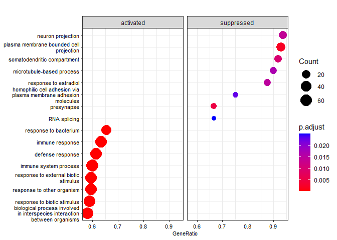
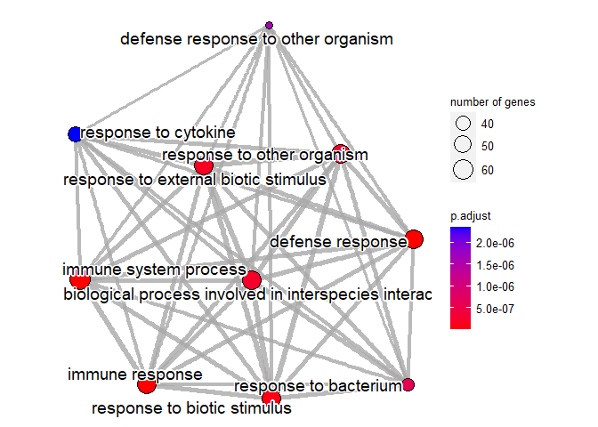
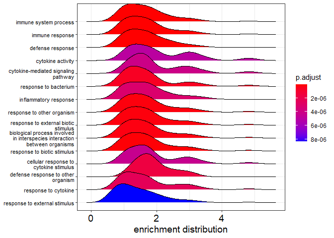

GSEA
================

# GSEA analysis of DGE results

### Required libraries:

library(“ggVennDiagram”) library(clusterProfiler) library(enrichplot)
library(“org.Hs.eg.db”, character.only = TRUE) library(ggplot2)

### Loading EdgeR and DESeq2 result data

``` r
RLE = read.csv("data/EdgeR_RLE_DEGs.csv", row.names = 1)
dim(RLE)
```

    ## [1] 318   4

``` r
head(RLE)
```

    ##             logFC   logCPM        F       PValue
    ## ERRFI1  0.3813296 7.447008 17.06566 1.149725e-03
    ## EPHA2   0.4878483 7.635323 19.19638 7.195130e-04
    ## PADI3  -0.6420647 5.028569 25.67724 2.067889e-04
    ## CDA     0.4903172 6.143275 18.64864 8.090371e-04
    ## IFI6    2.4200367 3.973778 54.98379 4.685493e-06
    ## PTAFR   0.4010808 7.107989 23.70045 2.950902e-04

``` r
TMM = read.csv("data/EdgeR_TMM_DEGs.csv", row.names = 1)
dim(RLE)
```

    ## [1] 318   4

``` r
head(TMM)
```

    ##             logFC   logCPM        F       PValue
    ## ERRFI1  0.3889668 7.447086 18.64363 8.645195e-04
    ## EPHA2   0.4962152 7.636536 18.94911 8.104830e-04
    ## PADI3  -0.6350760 5.027808 24.97391 2.556570e-04
    ## CDA     0.4973294 6.143643 19.25813 7.597658e-04
    ## IFI6    2.4257604 3.974884 53.72296 6.286267e-06
    ## PTAFR   0.4088877 7.108548 24.74347 2.662123e-04

``` r
UQ = read.csv("data/EdgeR_UQ_DEGs.csv", row.names = 1)
dim(UQ)
```

    ## [1] 315   4

``` r
head(UQ)
```

    ##              logFC   logCPM         F       PValue
    ## EPHA2    0.4573601 7.632941  16.78947 1.080198e-03
    ## PADI3   -0.6710917 5.031531  27.03078 1.333269e-04
    ## IFI6     2.3905339 3.968633  54.70505 3.304121e-06
    ## PTAFR    0.3717725 7.106287  18.91052 6.626953e-04
    ## ZC3H12A  1.6416186 6.020902 167.08043 3.439512e-09
    ## HYI      0.4846646 4.810837  18.44111 7.361845e-04

``` r
DESeq2 = read.csv("data/DESeq2_DEGs.csv", row.names = 1)
head(DESeq2)
```

    ##            baseMean log2FoldChange     lfcSE    pvalue      padj
    ## DDX11L1     0.00000             NA        NA        NA        NA
    ## WASH7P     29.13007     0.01016534 0.1223053 0.7614525 0.9436221
    ## FAM138A     0.00000             NA        NA        NA        NA
    ## FAM138F     0.00000             NA        NA        NA        NA
    ## OR4F5       0.00000             NA        NA        NA        NA
    ## LOC729737 130.42240     0.03359339 0.1163691 0.5325180 0.8709538

### Isolating DEGs from DESeq2 results (EdgeR results only include DEGs)

``` r
DESeq2 = DESeq2[complete.cases(DESeq2),] # remove NAs 
DESeq2 = DESeq2[DESeq2$padj<0.05,]
summary(DESeq2$log2FoldChange)
```

    ##    Min. 1st Qu.  Median    Mean 3rd Qu.    Max. 
    ## -1.5057 -0.3188  0.3961  0.4410  0.7488  4.7490

### Comparing gene lists using the 3 methods

``` r
gene_list = list(row.names(RLE), row.names(TMM), row.names(UQ), row.names(DESeq2))
ggVennDiagram(gene_list, label_alpha = 0, category.names = c('RLE', 'TMM', 'UQ', 'DESeq2'))+ ggplot2::scale_fill_gradient(low="white",high = "green")
```

<!-- -->

#### Isolating the 285 genes that are common among all 4

``` r
Genes = Reduce(intersect, gene_list)
```

#### Cleaning data. Going to use EdgeR TMM as the base for LFc values

``` r
# we want the log2 fold change 
df = TMM[row.names(TMM) %in% Genes,]
gene_list = df$logFC

# name the vector
names(gene_list) = row.names(df)

# sort the list in decreasing order (required for clusterProfiler)
gene_list = sort(gene_list, decreasing = TRUE)
```

## Gene Ontology (GO) Analysis

``` r
organism = "org.Hs.eg.db"
gse = gseGO(geneList=gene_list, 
             ont ="ALL", 
             keyType = "SYMBOL", 
             minGSSize = 3, 
             maxGSSize = 800, 
             pvalueCutoff = 0.05, 
             verbose = TRUE, 
             OrgDb = organism, 
             pAdjustMethod = "none")
```

    ## preparing geneSet collections...

    ## GSEA analysis...

    ## leading edge analysis...

    ## done...

## Dot plot

``` r
require(DOSE)
```

    ## Loading required package: DOSE

    ## Warning: package 'DOSE' was built under R version 4.1.2

    ## DOSE v3.20.1  For help: https://yulab-smu.top/biomedical-knowledge-mining-book/
    ## 
    ## If you use DOSE in published research, please cite:
    ## Guangchuang Yu, Li-Gen Wang, Guang-Rong Yan, Qing-Yu He. DOSE: an R/Bioconductor package for Disease Ontology Semantic and Enrichment analysis. Bioinformatics 2015, 31(4):608-609

``` r
dotplot(gse, showCategory=10, split=".sign") + facet_grid(.~.sign)
```

<!-- -->

## GSEA plot

``` r
gseaplot(gse, by = "all", title = gse$Description[1], geneSetID = 1)
```

<!-- -->

## Enrichment map plot

``` r
gse_p = pairwise_termsim(gse)
emapplot(gse_p, showCategory = 10)
```

<!-- -->

## Ridgeplot

``` r
ridgeplot(gse) + labs(x = "enrichment distribution")
```

    ## Picking joint bandwidth of 0.301

<!-- -->
